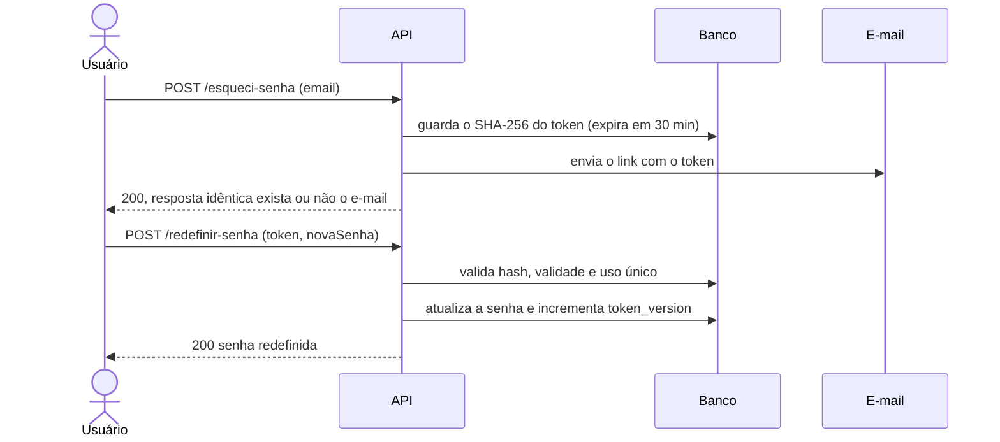

<div align="center">

# 🔐 Auth System

**API de autenticação completa: cadastro, login com JWT e recuperação de senha, com foco em segurança e testes.**

[](https://github.com/gustavorosarionunes/auth-system/actions/workflows/ci.yml)


🌐 **Demo:** *(adicione aqui o link do deploy no Render)* &nbsp;·&nbsp; ⏱️ *plano gratuito: a primeira requisição pode levar ~30 s*

</div>

---

## 📑 Sumário

- [Visão geral](#-visão-geral)
- [Funcionalidades](#-funcionalidades)
- [Stack](#-stack)
- [Como rodar](#-como-rodar)
- [Configuração](#-configuração)
- [Referência da API](#-referência-da-api)
- [Fluxo de recuperação de senha](#-fluxo-de-recuperação-de-senha)
- [Decisões de segurança](#-decisões-de-segurança)
- [Testes](#-testes)
- [CI/CD e deploy](#-cicd-e-deploy)
- [Estrutura do projeto](#-estrutura-do-projeto)
- [Limitações conhecidas](#-limitações-conhecidas)
- [Roadmap](#-roadmap)
- [Autor](#-autor)

---

## 🎯 Visão geral

Sistema de autenticação construído para demonstrar, na prática, como implementar **login seguro** do zero, sem depender de serviços prontos. O projeto reúne uma API REST, uma interface web simples e uma suíte de testes de integração que comprova cada regra de segurança.

Ele é o "lado da defesa" do meu projeto [API de Pedidos Vulnerável](https://github.com/gustavorosarionunes/api-pedidos-vulneravel), que implementa de propósito falhas do OWASP Top 10. Aqui, essas falhas são evitadas por design.

## ✨ Funcionalidades

- **Cadastro** com validação de nome, e-mail e política de senha
- **Login** que devolve um **JWT** (expira em 1 h)
- **Rota protegida** (`/me`) autenticada por `Bearer token`
- **Recuperação de senha** por token de uso único e validade curta
- **Bloqueio automático** da conta após 5 tentativas erradas
- **Interface web** com telas de login, cadastro, recuperação e redefinição (com botão mostrar/ocultar senha)
- **Testes de integração**, **Docker**, **CI** no GitHub Actions e **deploy** declarativo no Render

## 🧰 Stack

| Camada | Tecnologia |
|---|---|
| Runtime | Node.js 22 LTS |
| Servidor HTTP | Express 4 |
| Banco de dados | SQLite (`better-sqlite3`) |
| Tokens | `jsonwebtoken` (HS256) |
| Hash de senha | `scrypt` nativo do Node (`crypto`) |
| Proteções HTTP | `helmet`, `cors`, `express-rate-limit` |
| Testes | `node:test` (nativo, sem dependências extras) |
| Infra | Docker, GitHub Actions, Render |

## 🚀 Como rodar

### Opção A: Node.js direto (Windows / PowerShell)

Requer **Node 22 LTS**.

```powershell
npm install
$env:JWT_SECRET = "cole-aqui-um-segredo-longo-e-aleatorio"
npm start
```

Abra **http://localhost:3000**.

### Opção B: Docker

```bash
cp .env.example .env        # edite o JWT_SECRET (veja "Configuração")
docker compose up --build
```

O banco fica no volume `dados`, então sobrevive a reinícios do container.

## ⚙️ Configuração

Copie o modelo e gere um segredo próprio:

```bash
cp .env.example .env
node -e "console.log(require('crypto').randomBytes(48).toString('hex'))"
```

Cole o resultado em `JWT_SECRET`. **Nunca suba o `.env` para o GitHub** (ele já está no `.gitignore`).

| Variável | Obrigatória | Padrão | Descrição |
|---|:-:|---|---|
| `JWT_SECRET` | em produção | segredo temporário | Chave de assinatura dos JWTs. Em produção precisa ter **32+ caracteres**, senão o processo se recusa a iniciar |
| `PORT` | não | `3000` | Porta HTTP |
| `DB_FILE` | não | `auth.db` | Caminho do arquivo SQLite |
| `APP_URL` | não | `http://localhost:3000` | Base do link enviado no e-mail de recuperação |
| `CORS_ORIGIN` | não | *(bloqueado)* | Origens permitidas, separadas por vírgula |
| `TRUST_PROXY` | não | *(desligado)* | Use `1` atrás de proxy (Render, Nginx) para o rate limit enxergar o IP real |

> O `npm start` não lê o arquivo `.env` sozinho. Use `node --env-file=.env server.js` ou defina a variável no terminal. O Docker Compose lê o `.env` automaticamente.

## 📡 Referência da API

Corpo e respostas em JSON. Rotas protegidas exigem `Authorization: Bearer <token>`.

| Método | Rota | Auth | Corpo | Sucesso |
|---|---|:-:|---|---|
| `POST` | `/api/auth/cadastro` | — | `{ nome, email, senha }` | `201` `{ id, nome, email }` |
| `POST` | `/api/auth/login` | — | `{ email, senha }` | `200` `{ token, tipo, expiraEm }` |
| `POST` | `/api/auth/esqueci-senha` | — | `{ email }` | `200` mensagem genérica |
| `POST` | `/api/auth/redefinir-senha` | — | `{ token, novaSenha }` | `200` mensagem de sucesso |
| `GET` | `/api/auth/me` | ✅ | — | `200` `{ id, nome, email }` |
| `GET` | `/api/saude` | — | — | `200` `{ ok: true }` |

**Política de senha:** 8 a 128 caracteres, com pelo menos uma letra e um número.

**Códigos de erro**

| Código | Quando acontece |
|:-:|---|
| `400` | Dados inválidos, JSON malformado, token de recuperação inválido ou expirado |
| `401` | Credenciais erradas, token ausente, inválido, expirado ou revogado |
| `409` | E-mail já cadastrado |
| `429` | Conta bloqueada por tentativas ou limite de requisições excedido |

<details>
<summary><strong>Exemplos com cURL</strong></summary>

<br>

> No PowerShell, use `curl.exe` (o `curl` puro é um alias de outro comando) ou teste pelo Postman.

```bash
# Cadastro
curl -X POST http://localhost:3000/api/auth/cadastro \
  -H "Content-Type: application/json" \
  -d '{"nome":"Ana","email":"ana@exemplo.com","senha":"senha1234"}'

# Login
curl -X POST http://localhost:3000/api/auth/login \
  -H "Content-Type: application/json" \
  -d '{"email":"ana@exemplo.com","senha":"senha1234"}'

# Rota protegida
curl http://localhost:3000/api/auth/me \
  -H "Authorization: Bearer SEU_TOKEN_AQUI"
```

</details>

## 🔄 Fluxo de recuperação de senha



> **Ambiente local:** o envio de e-mail é **simulado**. O link aparece no console do servidor com o prefixo `📧 [e-mail simulado]`. Para produção, troque a função em `mailer.js` por um provedor real (nodemailer, SES, SendGrid...).

## 🛡️ Decisões de segurança

| Ameaça | Como o projeto se protege |
|---|---|
| Vazamento do banco | Senhas com **scrypt** + salt aleatório por usuário, comparação em tempo constante (`timingSafeEqual`) |
| Força bruta | Bloqueio de 15 min após 5 erros e **rate limit por IP** (50 req / 15 min) nas rotas de auth |
| Enumeração de usuários | Login com mensagem genérica, mesmo tempo de resposta para e-mail inexistente e `esqueci-senha` com resposta idêntica |
| Roubo de token de recuperação | Token de 256 bits, guardado só como **hash SHA-256**, validade de 30 min, **uso único**; um novo pedido invalida o anterior |
| Sessão após troca de senha | `token_version` no JWT: ao redefinir a senha, todos os tokens antigos deixam de valer |
| Forjar JWT | Algoritmo fixado em HS256 na verificação (rejeita `alg: none` e assinatura de outro segredo) |
| SQL Injection | Todas as consultas **parametrizadas** |
| XSS | Front-end usa `textContent`; CSP do `helmet` bloqueia scripts inline |
| Segredo fraco em produção | O processo **se recusa a iniciar** sem `JWT_SECRET` de 32+ caracteres |
| Abuso de payload | Corpo limitado a 10 KB; CORS bloqueado por padrão |

## 🧪 Testes

```bash
npm test
```

**20 testes de integração** com `node:test`. Eles sobem a API de verdade numa porta aleatória, com banco em memória, e chamam os endpoints via HTTP. Sem dependências extras.

| Área | Testes | O que é verificado |
|---|:-:|---|
| Configuração | 1 | Em produção, recusa iniciar sem `JWT_SECRET` forte |
| Cadastro | 4 | E-mail duplicado (mesmo com maiúsculas), senha fraca, e-mail inválido, senha guardada como hash |
| Login e JWT | 4 | Login abre `/me`; erro de senha e e-mail inexistente dão a mesma resposta; token forjado (`alg: none`, outro segredo) é recusado; JSON malformado |
| Bloqueio | 2 | 5 erros bloqueiam (até com a senha certa); o bloqueio expira; login válido zera o contador |
| Recuperação | 9 | Resposta idêntica; só o hash é guardado; validade de 30 min; uso único; token expirado ou malformado; novo pedido invalida o anterior; JWT antigo deixa de valer |

O envio de e-mail fica isolado em `mailer.js`, então os testes o substituem por um mock e capturam o token sem ler o console.

## 🚢 CI/CD e deploy

**GitHub Actions** (`.github/workflows/ci.yml`), a cada push e pull request:

1. `npm test`: os 20 testes
2. `npm audit --omit=dev --audit-level=high`: falha se houver dependência com vulnerabilidade alta ou crítica
3. Build da imagem Docker: garante que o `Dockerfile` sempre funciona

O **Dependabot** abre PRs semanais atualizando dependências do npm e das Actions.

**Deploy no Render** (plano gratuito), via `render.yaml`:

1. Suba o repositório no GitHub.
2. No [Render](https://dashboard.render.com): **New → Blueprint** e selecione o repositório. O `render.yaml` é lido automaticamente.
3. Depois do primeiro deploy, edite `APP_URL` em **Environment** com a URL pública gerada.

O `JWT_SECRET` é gerado pelo próprio Render e o health check usa `/api/saude`.

## 🗂️ Estrutura do projeto

```
auth-system/
├── server.js               # rotas, middlewares e configuração do Express
├── security.js             # hash de senha, JWT e SHA-256
├── db.js                   # schema SQLite (usuarios, reset_tokens)
├── mailer.js               # envio do e-mail de recuperação (simulado)
├── public/                 # interface web (HTML, CSS, JS)
├── test/auth.test.js       # testes de integração
├── Dockerfile
├── docker-compose.yml
├── render.yaml             # deploy declarativo no Render
├── .env.example
└── .github/
    ├── workflows/ci.yml    # testes, auditoria e build Docker
    └── dependabot.yml
```

## ⚠️ Limitações conhecidas

- **E-mail simulado:** o link de recuperação aparece no log do servidor, não na caixa de entrada. Na demo pública, ele só é visível nos logs do Render.
- **Banco no plano gratuito do Render:** o disco não é persistente, então o SQLite reseta a cada deploy. Serve para demonstração, não para produção.
- **Token no `sessionStorage`:** simples, mas exposto se algum dia houver uma falha de XSS. A alternativa mais segura é cookie `httpOnly`.
- **Sem logout no servidor:** "Sair" apenas descarta o token no navegador; ele vale até expirar (1 h) ou até a senha ser trocada.

## 🗺️ Roadmap

- [ ] Refresh token com rotação e logout real (revogação no servidor)
- [ ] Cookie `httpOnly` + proteção CSRF
- [ ] Envio real de e-mail (nodemailer)
- [ ] Verificação de e-mail no cadastro
- [ ] 2FA com TOTP
- [ ] Migração para PostgreSQL
- [ ] Documentação OpenAPI/Swagger

## 👤 Autor

**Gustavo do Rosário Nunes**
Estudante de Engenharia de Software (Univille) · Backend e Segurança de Aplicações

[GitHub] (https://github.com/gustavorosarionunes)
[LinkedIn](https://www.linkedin.com/in/gustavo-do-rosario-nunes)
